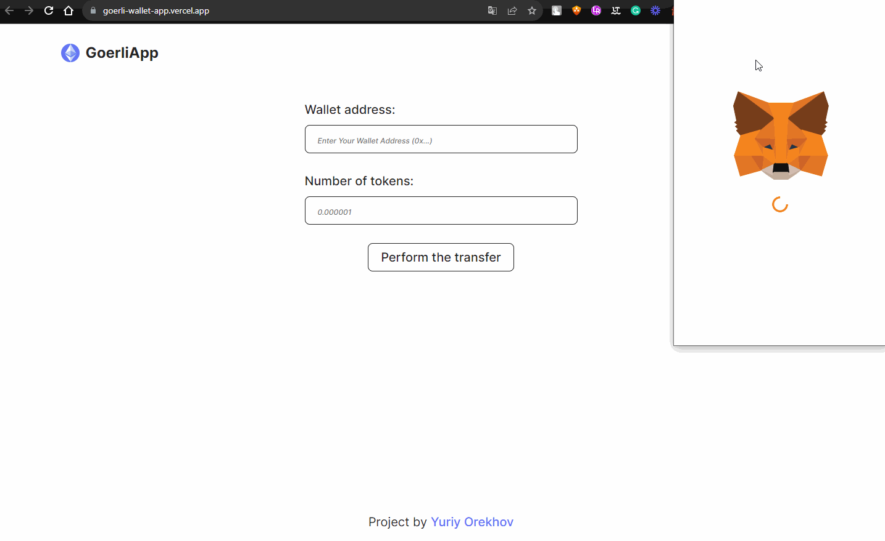

# ⭐ My Goerli Wallet App ⭐

This is a simple React web application that allows users to perform transactions
with Ethereum wallets on the Goerli testnet. Users can input their wallet
address and the number of tokens they want to transfer, and the app will perform
the transfer after validating the inputs.

## Features

- Connect your Ethereum wallet using MetaMask.
- Input your wallet address and the number of tokens to transfer.
- Validate the wallet address format and the number of tokens.
- Perform the transfer on the Goerli testnet.
- Display toast notifications for success and error messages.

## Demo

## Installation

1. Clone the repository:
   `git clone https://github.com/yuriy-o/GoerliWalletApp.git`

2. Navigate to the project folder: `cd GoerliWalletApp`

3. Install dependencies: `npm install`

## Usage

1. Start the development server: `npm run dev`
2. Open your browser and go to [http://localhost:8899/](http://localhost:8899/).
3. Connect your Ethereum wallet using MetaMask.
4. Enter your wallet address (in the format 0x...) and the number of tokens to
   transfer.
5. Click on the "Perform the transfer" button to initiate the transfer.

## Prerequisites

Before running the application, make sure you have the following installed on
your system:

Node.js: Make sure you have Node.js installed on your computer. You can download
it from the official website: [https://nodejs.org](https://nodejs.org).

MetaMask Extension: To connect your Ethereum wallet and perform transactions,
you will need to have the MetaMask extension installed in your web browser. You
can download MetaMask from the official website:
[https://metamask.io](https://metamask.io).

Please ensure you have these prerequisites installed before running the
application. If you encounter any issues during the installation process, refer
to the official websites for troubleshooting and support.

Feel free to customize the description and add any specific instructions or
links for the installation process of Node.js and MetaMask.

## Contributing

Contributions are welcome! If you find any issues or have suggestions for
improvements, please open an issue or create a pull request.

## License

This project is licensed under the [MIT License](LICENSE).
